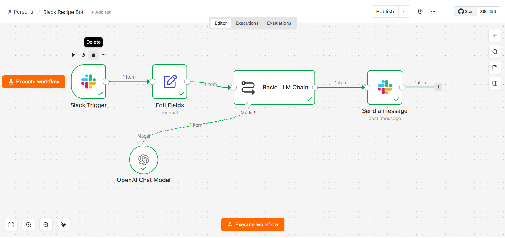

# n8n Slack Recipe Bot

A lightweight [n8n](https://n8n.io) automation that turns a Slack channel into a recipe-ingredient assistant. Mention a dish in Slack, and the bot replies in-channel with a clear, practical shopping list generated by an LLM.



## How it works

1. **Slack Trigger** — Listens for new messages in a designated Slack channel (`#receipeee`).
2. **Edit Fields** — Extracts the message text into a `recipe` field and passes the rest of the payload through.
3. **Basic LLM Chain** (+ **OpenAI Chat Model**, `gpt-4o-mini`) — Prompts the model to list all products and ingredients needed for the requested recipe, returned as a short, practical bulleted list with approximate quantities. If the recipe name is unclear, the model asks the user to rephrase.
4. **Send a message** — Posts the generated ingredient list back to the same Slack channel.

```
Slack Trigger → Edit Fields → Basic LLM Chain → Send a message
                                     ↑
                              OpenAI Chat Model
```

## Prerequisites

- An [n8n](https://n8n.io) instance (cloud or self-hosted)
- A Slack app/bot with credentials for:
  - Receiving message events (Slack Trigger)
  - Posting messages (`chat:write` scope)
- An OpenAI API key with access to `gpt-4o-mini`

## Setup

1. In n8n, go to **Workflows → Import from File** and select [`slack-recipe-bot.json`](slack-recipe-bot.json).
2. Configure credentials:
   - **Slack API** — used by both the Slack Trigger and the Send a message node.
   - **OpenAI API** — used by the OpenAI Chat Model node.
3. Update the `channelId` on the **Slack Trigger** and **Send a message** nodes to point at your target Slack channel.
4. Activate the workflow.

## Usage

Post a message in the configured Slack channel naming a recipe, for example:

```
lemon garlic butter chicken
```

The bot replies with a bulleted ingredient list and approximate quantities.

## Notes

- The LLM prompt intentionally keeps output short and practical rather than a full recipe/method.
- If the recipe name is ambiguous, the bot asks the user to rephrase instead of guessing.

## License

[MIT](LICENSE)
